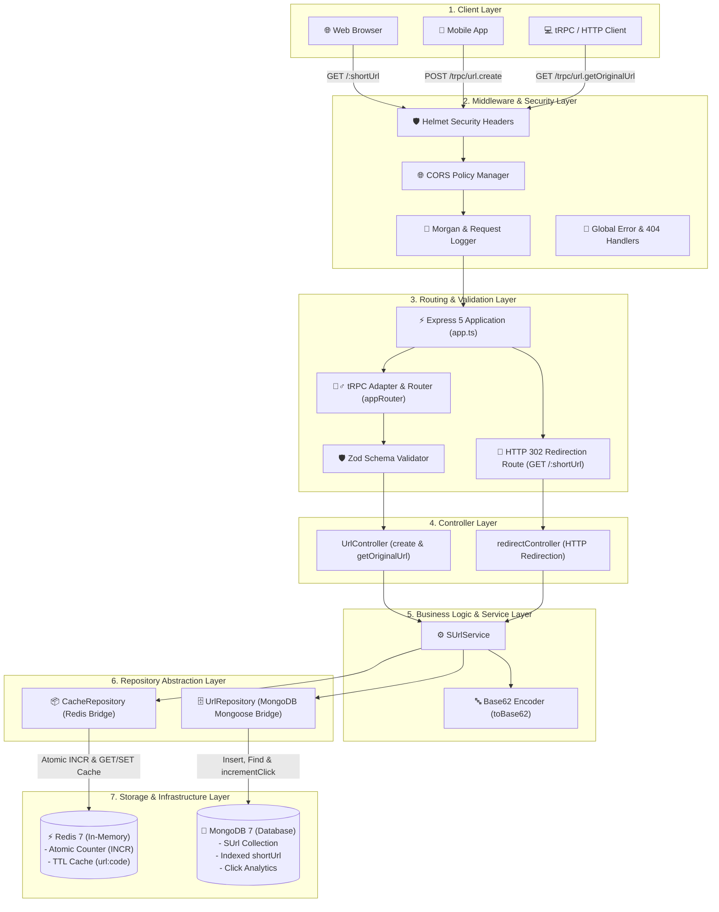
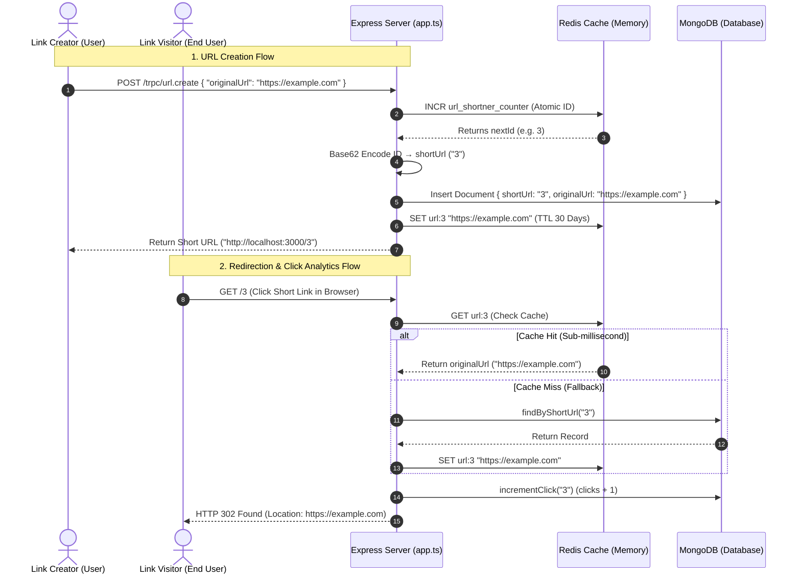

# 🔗 URL Shortener Microservice (Express + TypeScript + tRPC + Redis + MongoDB + Docker)

A production-grade, high-performance **URL Shortener Microservice** built with **Express 5**, **TypeScript**, **tRPC v11**, **Zod**, **MongoDB (Mongoose)**, **Redis**, and **Docker**.

Features atomic Base62 short-code generation, fast Redis caching, tRPC Endpoints with Zod schema validation, HTTP 302 redirection, and Docker containerization with hot-reloading.

---

## ✨ Features

- ⚡ **TypeScript & Express 5**: Strict type safety with modern async request handling.
- 🧙‍♂️ **tRPC v11 Integration**: End-to-end type-safe API procedures (`url.create`, `url.getOriginalUrl`).
- 🛡️ **Zod Validation**: Input payload validation with custom error messages.
- 🚀 **High Performance Redis Cache**: Sub-millisecond lookup cache for short URL resolution and atomic counter generation.
- 🍃 **Persistent MongoDB Storage**: Mongoose schemas with indexed `shortUrl` and click tracking.
- 🔀 **HTTP 302 Redirection**: Dedicated high-speed Express redirection route (`GET /:shortUrl`) with click analytics.
- 🐳 **Docker & Docker Compose**: Instant multi-container setup (Express + MongoDB + Redis) with volume mounts for live hot reloading.
- 🛡️ **Security**: Pre-configured with `helmet` and `cors` security headers.
- 📦 **Smart Dependency Helper**: Custom `npm run add` command to install packages on Mac and Docker simultaneously.

---

## 🏛️ 1. Full System Architecture Diagram (Component Blocks)



---

## 📐 2. User Perspective Sequence Diagram (Flow of Requests)



---

## 🏗️ Architecture & Technology Stack

| Layer | Technology | Description |
| :--- | :--- | :--- |
| **Runtime & Language** | Node.js 20 & TypeScript 5 | Typed server-side JavaScript runtime |
| **API Framework** | Express.js 5 & tRPC 11 | Type-safe RPC router & Express HTTP server |
| **Schema Validation** | Zod | Runtime type safety & payload validation |
| **Caching Layer** | Redis 7 | In-memory cache for fast lookups & atomic ID counter |
| **Database** | MongoDB 7 (Mongoose 9) | Persistent document store for URL mapping & analytics |
| **Orchestration** | Docker & Docker Compose | Containerization for app, database, and cache |

---

## 📁 Project Structure

```text
├── src/
│   ├── config/          # Environment configuration & DB/Redis setup
│   ├── controllers/     # Controller layer & Express redirect handlers
│   ├── dtos/            # Data Transfer Objects & TypeScript interfaces
│   ├── middlewares/     # Error handling, 404, logger middlewares
│   ├── models/          # Mongoose database schemas (SUrlModel)
│   ├── repositories/    # Database & Redis caching repository layer
│   ├── routes/          # Express API & tRPC router definitions
│   │   ├── trpc/        # tRPC appRouter, context, and urlRouter
│   │   ├── v1/          # Express REST API v1 routes
│   │   └── v2/          # Express REST API v2 routes
│   ├── services/        # Business logic layer (SUrlService)
│   ├── utils/           # ApiError, ApiResponse, Base62 encoder, asyncHandler
│   ├── app.ts           # Express app initialization & middleware stack
│   └── server.ts        # Entrypoint, server boot & graceful shutdown
├── Dockerfile           # Multi-stage Docker build config
├── docker-compose.yml   # Multi-container orchestration (App, Mongo, Redis)
├── .env.example         # Template environment file
├── tsconfig.json        # TypeScript configuration
├── package.json
└── README.md
```

---

## ⚙️ Quick Start

### 1. Prerequisites

- [Docker Desktop](https://www.docker.com/products/docker-desktop/) installed and running.

### 2. Setup Environment Variables

```bash
cp .env.example .env
```

### 3. Launch with Docker Compose

```bash
npm run docker:up
```

This starts:
- **Express API & tRPC Server**: `http://localhost:3000`
- **MongoDB**: `localhost:27017`
- **Redis**: `localhost:6379`

---

## 📡 API Reference & Usage

### 1. Create a Short URL (`tRPC Mutation`)

**Endpoint**: `POST http://localhost:3000/trpc/url.create`

```bash
curl --location 'http://localhost:3000/trpc/url.create' \
--header 'Content-Type: application/json' \
--data '{
    "originalUrl": "https://trpc.io/docs/server/adapters/express"
}'
```

**Response**:
```json
{
  "result": {
    "data": {
      "id": "6a5d09de6bbccc10a0c0a003",
      "shortUrl": "3",
      "originalUrl": "https://trpc.io/docs/server/adapters/express",
      "clicks": 0,
      "fullUrl": "http://localhost:3000/3",
      "createdAt": "2026-07-19T17:31:10.604Z",
      "updatedAt": "2026-07-19T17:31:10.604Z"
    }
  }
}
```

---

### 2. Inspect / Get Original URL (`tRPC Query`)

Read-only lookup. Does **not** increment click analytics.

**Endpoint**: `GET http://localhost:3000/trpc/url.getOriginalUrl`

```bash
curl -G 'http://localhost:3000/trpc/url.getOriginalUrl' \
  --data-urlencode 'input={"shortUrl":"3"}'
```

**Response**:
```json
{
  "result": {
    "data": {
      "originalUrl": "https://trpc.io/docs/server/adapters/express",
      "shortUrl": "3"
    }
  }
}
```

---

### 3. Redirection & Click Counter (`HTTP 302 GET /:shortUrl`)

Visits the short code, increments the click counter, and redirects the browser/client.

**Endpoint**: `GET http://localhost:3000/:shortUrl`

```bash
curl -i http://localhost:3000/3
```

**Response**:
```http
HTTP/1.1 302 Found
Location: https://trpc.io/docs/server/adapters/express

Found. Redirecting to https://trpc.io/docs/server/adapters/express
```

---

## 📦 NPM & Docker Scripts

| Script | Command | Description |
| :--- | :--- | :--- |
| `npm run dev` | `node --import tsx --watch src/server.ts` | Starts development server with native hot reloading |
| `npm run add package-name` | `sh -c 'npm i "$@" && docker exec express_app npm i "$@"' --` | Installs dependency on Mac and Docker container simultaneously |
| `npm run build` | `tsc` | Compiles TypeScript source to `dist/` |
| `npm start` | `node dist/server.js` | Runs production JavaScript build |
| `npm run docker:up` | `docker compose up -d --build` | Launches all containers in background |
| `npm run docker:down` | `docker compose down` | Stops Docker containers |
| `npm run docker:clean` | `docker compose down -v` | Stops containers and removes database volumes |
| `npm run docker:reset` | `docker compose down -v && docker compose up -d --build` | Full fresh container rebuild |
| `npm run docker:logs` | `docker compose logs -f` | Tails live container logs |
| `npm run lint` | `eslint .` | Runs ESLint analysis |
| `npm run format` | `prettier --write "src/**/*.ts"` | Formats code with Prettier |

---

## 📄 License

This project is open-source under the ISC License.
